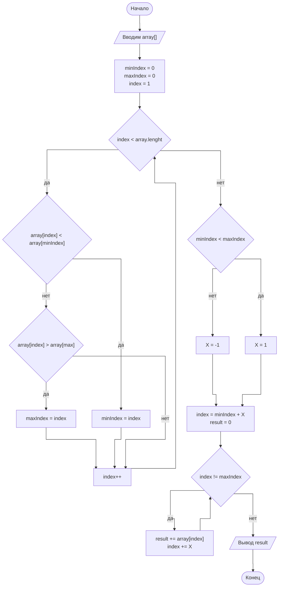

# Инструкция для работы с Markdown

## Выделение текста

Для выделение текста курсивом обрамите его `*` или `_` <br> 
*Курсив.*

Для выделение текста полужирным обрамите его `**` или `__` - <br> 
**Полужирный.**

Альтернативный способы для выделения текста жирным и курсивом нужны для того, чтобы совместить эти два способа.<br> Например, _текст может быть выделен курсивом и при этом может быть **полужирным**._

## Списки

Для не нумерованного списка нужно в начале поставить *
* Элемент 1
* Элемент 2
* Элемент 3
* Элемент 4

Для нумерованного списка необходимо пункты просто пронумеровать. 
1. Первый элемент нумерованного списка.
2. Второй элемент нумерованного списка.
3. Третий элемент нумерованного списка.
4. Четвертый элемент нумерованного списка.

## Работа с изображением

Чтобы вставить картинку нужно записать <br>``


## Ссылки

Ссылка делаестя следующим образом `[ссылка](example.com "Не обязательная подсказка")`

[Пример ссылки](example.com "Не обязательная подсказка")

## Работа с таблицами
Для создания таблиц необходимо записать
```
| LEFT | CENTER | RIGHT |
|:------------|:---------:|----------------:|
| По левому краю | По центру | По правому краю |
| текст | текст | текст |
```
| LEFT | CENTER | RIGHT |
|:------------|:---------:|----------:|
| По левому краю | По центру | По правому краю |
| текст | текст | текст |


## Цитаты

Для цитат нужно поставить >
> Первый уровень цитирования
>> Второй уровень цитирования
>>> Третий уровень цитирования

## Диаграммы
Чтобы смотреть в VSC в preview диаграммы нужно установить расширение [Markdown Preview Mermaid Support](https://marketplace.visualstudio.com/items?itemName=bierner.markdown-mermaid)

Инструкция по диаграммам [тут](https://habr.com/ru/post/652867/#flowchart)


**Задача:** Найти сумму элементов массива, лежащих между максимальным и минимальным по значению элементами.


## **Основные команды Git**

* git init – инициализация локального репозитория
* git status – получить информацию от git о его текущем состоянии
* git add file_name – добавить файл или файлы к следующему коммиту
* git commit -m “message” – создание коммита.
* git commit -am “message” - добавление файлов, которые уже были в предыдущих комитах и закомитить их с сообщение message.
* git commit --amend "message" - редактирование сообщения последнего комита
* git log – вывод на экран истории всех коммитов с их хеш-кодами
* git log --oneline - вывод лога, но в сокращенном виде.
* git checkout – переход от одного коммита к другому
* git checkout master – вернуться к актуальному состоянию и продолжить работу
* git checkout -b branch_name - создаст ветку и перемещаемся на нее
* git diff – увидеть разницу между текущим файлом и закоммиченным файлом
* git rm file_name – удаляет файл
* git mv file_name - передвигает и изменяет названия файла
* git restore (--staged) - отменяет не закомиченные изменения 
* git branch branch_name - создание новой ветки
* git branch - просмотр всех веток
* git branch -d branch_name - удаление ветки
* git merge  branch_name - слияние веток
* git reset --hard хешсумма - переместится на commit хешсуммы и частично удалит последующие commit
* git clone  -  склонировать внешний репозиторий на наш ПК
* git pull  - скачать все из текущего репозитория и автоматически сделать merge с нашей версией 
* git push  - отправить нашу версию репозитория на внешний репозиторий. ТРЕБУЕТ АВТОРИЗАЦИИ на внешнем репозитории 

